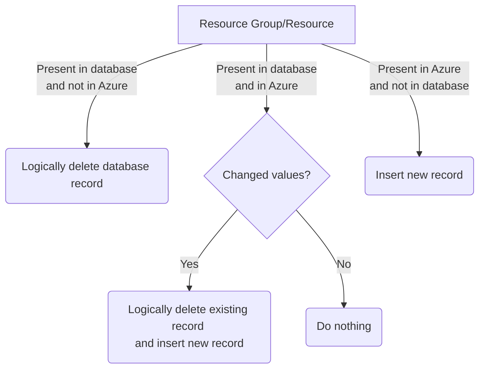

# LASER Activity

Azure Function App used to run Python scripts that insert LASER usage costs into SQL Database.

Scheduled to run once every a day at 0700.

## What it does

There are several functions within the function app, each responsible for fetching specific activity data and populating a database. 
- [LASER Costs](#laser-costs) : costs accrued by each resource in LASER
- [LASER Resources](#laser-resources) : Resource Groups and Resources, along with useful tags for each
- LASER Budgets
- LASER VMs
- LASER Users

### LASER Costs

[Cost Management and Usage Data Updates & Retention](https://learn.microsoft.com/en-us/azure/cost-management-billing/costs/understand-cost-mgt-data#cost-and-usage-data-updates-and-retention)  

Important points from the above link:  

> Azure finalizes or closes the current billing period up to 72 hours (three calendar days) after the billing period ends.

> During the open month (uninvoiced) period, cost management data should be considered an estimate only. In some cases, charges may be latent in arriving to the system after the usage actually occurred.

Because costs are mutable until three days after the monthly billing period has closed, the function:
- iterates through the last 35 days, pulling data from the Cost Management API one day at a time at subscription scope
- compares each record with those already present in the database
	- matches records using [UsageDate], [ResourceGroup], [ResourceId], [Meter], [MeterSubCategory], [MeterCategory], [TagKey], [TagValue] 
- inserts any not present direct to [dbo].[tblUsageCosts]
- updates any records already present but with a different [PreTaxCost] 
	- truncates staging table
	- inserts to staging table [stg].[UsageCostsUpdate]
	- updates records in [dbo].[tblUsageCosts] from [stg].[UsageCostsUpdate] on SQL database using primary key [UsageCostsId] of existing record  

### LASER Resources

First compares Resource Groups and then Resources returned by Azure SDK (azure.mgmt.resource) with those already present in the SQL database.  
- ResourceGroup as a unique identifier for Resource Groups  
- ResourceID as a unique identifier for Resources  

By treating Resource Groups and Resources as Type 2 Slowly Changing Dimensions we can maintain a history of a VRE.  

## Permissions

The Azure Logic App uses System Managed Identity to authenticate against the resources it interacts with. 

It requires membership to the following roles:  
|Scope|Role|
|---|---|
|Subscription|Reader|
|Azure SQL Database|db_datareader  db_datawriter  db_ddladmin|

