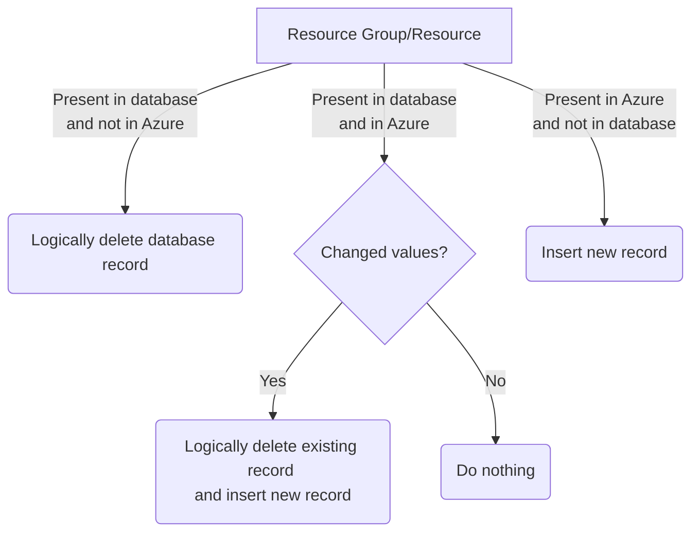

# LASER Activity

Azure Function App used to run Python scripts that insert details about LASER usage and costs from Azure APIs into a SQL Database.  

Scheduled to run once every a day, each function executing 10 minutes after the last starting at 0700, independently and in the following order:
1. laser_costs 
2. laser_resources
3. laser_vm
4. laser_users
5. laser_budgets

Each function has a ten minute maximum timeout on the Consumption plan.  

## What it does

There are several functions within the function app, each responsible for fetching specific activity data and populating a database.  

Each function consists of an \_\__init\_\__ file that kicks off methods contained in a file named after the function in the same folder, as well as a shared helper file _SQL_\__stuff.py_.

SubscriptionId, SQL Server & Database are all hard coded rather than parameterised. This was a design choice made because we'll only be using this to collect activity data from LASER into Prism.  

- [LASER Costs](#laser-costs) : costs accrued by each resource in LASER, split across two functions to mitigate risk of timeout
- [LASER Resources](#laser-resources) : Resource Groups and Resources, along with useful tags for each
- [LASER VMs](#laser-vms) : VM sizes and Start/Stop event times, along with who initiated them
- [LASER Users](#laser-users) : Azure AD groups and their memberships
- [LASER Budgets](#laser-budgets) : all Budgets present across the subscription

### LASER Costs

[Cost Management and Usage Data Updates & Retention](https://learn.microsoft.com/en-us/azure/cost-management-billing/costs/understand-cost-mgt-data#cost-and-usage-data-updates-and-retention)  

Important points from the above link:  

> Azure finalizes or closes the current billing period up to 72 hours (three calendar days) after the billing period ends.

> During the open month (uninvoiced) period, cost management data should be considered an estimate only. In some cases, charges may be latent in arriving to the system after the usage actually occurred.

Because costs are mutable until three days after the monthly billing period has closed, the functions:
- iterates through the last 35 days, pulling data from the Cost Management API one day at a time at subscription scope
    - Split across two functions to mitigate risk of timeout, given the ten minute limit of Function Apps on a Consumption plan. The first  half of the 35 day period covered by one and the next by the other:  
        - laser_costs_35to17
        - laser_costs_18toNow
- compares each record with those already present in the database
	- matches records using [UsageDate], [ResourceGroup], [ResourceId], [Meter], [MeterSubCategory], [MeterCategory], [TagKey], [TagValue] 
- inserts any not present direct to [dbo].[tblLaserUsageCosts]
- updates any records already present but with a different [PreTaxCost] 
	- truncates staging table
	- inserts to staging table [stg].[UsageCostsUpdate]
	- updates records in [dbo].[tblLaserUsageCosts] from [stg].[tblLaserUsageCostsUpdate] on SQL database using primary key [UsageCostsId] of existing record  

### LASER Resources

First compares Resource Groups and then Resources returned by Azure SDK (azure.mgmt.resource) with those already present in the SQL database.  
- [ResourceGroup] as a unique identifier for Resource Groups  
    - inserted to [dbo].[tblLaserResources]
- [ResourceID] as a unique identifier for Resources  
    - inserted to [dbo].[tblLaserResourceGroups]

Unfortunately I can't see that Azure Resource Management maintains a historic record of Resource Groups and Resources, but by treating Resource Groups and Resources as Type 2 Slowly Changing Dimensions in the database we can maintain a history of a VRE.  



### LASER VMs 

Similar to Resoures, Azure doesn't appear to maintain historic records of Virtual Machines, so we pull their hardware profile size (eg 'Standard_D4s_v4' etc.) each day from Azure and update the database as a Type 2 Slowly Changing Dimension, following the same logic as shown in the [LASER Resources](#laser-resources) diagram.    
- inserted to [dbo].[tblLaserVmSizes]

Then for each VM ResourceID, gets yesterday's Start and Stop activity data:
- Checks against records that may be already present in the database for the same event date and event id
- Writes to the database all records not already present  
- inserted to [dbo].[tblLaserVmActivity]  

Microsoft only retain activity data in Azure for 90 days:  
[Activity log retention period](https://learn.microsoft.com/en-us/azure/azure-monitor/essentials/activity-log?tabs=powershell#retention-period)

### LASER Users  

Uses Microsoft Graph to get all Azure AD groups that follow the LASER naming convention (and a couple that don't). The group filter is:  
```
startswith(displayName,'VRE-p')  
or startswith(displayName,'VRE-s')  
or startswith(displayName,'VRE-u')  
or startswith(displayName,'VRE-t')  
or startswith(displayName,'PICANet-')  
or startswith(displayName,'PICANetv2-')  
or displayName eq 'LRDP-All-Citrix-Users'  
or displayName eq 'LRDP-All-Citrix-SafeRoom-Users'  
```
Then gets all direct members of each Azure AD group returned. Nested groups are ignored.  

The returned result sets are (or can be) paginated. This is handled for both Groups and Group Members by an initial GET request that obtains an '@odata.nextLink' URL if there is one. If present there follows a loop that uses the nextLink URL to obtain the next page of results.  

Both Groups and Group Members result sets are inserted to the SQL Database as a Type 2 Slowly Changing Dimension, following the same logic as shown in the [LASER Resources](#laser-resources) diagram.  

Groups inserted to [dbo].[tblLaserAADGroups]
Group members inserted to [dbo].[tblLaserAADGroupMembers]    

### LASER Budgets
Gets details of all Budgets present across the subscription, uses [budget_id] as unique identifier to compare against those already present in the database.  

Treated as a Type 2 Slowly Changing Dimension, following the same logic as shown in the [LASER Resources](#laser-resources) diagram, inserting records to [dbo].[tblLaserBudgets].  

Resource Group not available directly, but is present in [BudgetID] as a token/substring. 

## Permissions

The Azure Function App use System Managed Identity to authenticate against most of the resources it interacts with.  

All functions require that the Azure Function App have membership to the roles in the table below, for authentication against the Azure REST API and/or the Azure SQL Database:  

|Scope|Role|
|---|---|
|Subscription|Reader|
|Azure SQL Database|db_datareader <br>db_datawriter <br>db_ddladmin|
|Key Vault|Secret Get <br>Secret List|

The function **laser_users** authenticates against the Microsoft Graph API via App Registration secret.  
- The secret has an expiry and will need renewing  
- The App registration requires the following Microsoft Graph Application API Permissions  
    - Directory.Read.All
    - Group.Read.All
    - GroupMember.Read.All
    - User.Read.All
- The secret is stored in a key vault, for which the Function App System Managed Identity requires access as above.  

## Azure REST API URLs 

These functions use _Azure SDK for Python_ to access the Azure REST APIs. While the actual URLs are 'hidden' behind the SDK the documentation suggests the following URLs are in use:

|Function|API used|URL|
|---|---|---|
|laser_budgets|[Budgets - Get](https://learn.microsoft.com/en-us/rest/api/consumption/budgets/get?tabs=HTTP)|https://management.azure.com/{scope}/providers/Microsoft.Consumption/budgets/{budgetName}?api-version=2023-03-01|
|laser_costs_...|[Query - Usage](https://learn.microsoft.com/en-us/rest/api/cost-management/query/usage?tabs=HTTP)|https://management.azure.com/{scope}/providers/Microsoft.CostManagement/query?api-version=2023-03-01|
|laser_resources|[Resource Groups - List](https://learn.microsoft.com/en-us/rest/api/resources/resource-groups/list)|https://management.azure.com/subscriptions/{subscriptionId}/resourcegroups?api-version=2021-04-01|
|laser_resources|[Resources - List By Resource Group](https://learn.microsoft.com/en-us/rest/api/resources/resources/list-by-resource-group)|https://management.azure.com/subscriptions/{subscriptionId}/resourceGroups/{resourceGroupName}/resources?api-version=2021-04-01|
|laser_users|[List groups](https://learn.microsoft.com/en-us/graph/api/group-list?view=graph-rest-1.0&tabs=http)|https://graph.microsoft.com/v1.0/groups|
|laser_users|[List group members](https://learn.microsoft.com/en-us/graph/api/group-list-members?view=graph-rest-1.0&tabs=http)|https://graph.microsoft.com/v1.0/groups/02bd9fd6-8f93-4758-87c3-1fb73740a315/members|
|laser_vm|[Virtual Machines - List All](https://learn.microsoft.com/en-us/rest/api/compute/virtual-machines/list-all?tabs=HTTP)|https://management.azure.com/subscriptions/{subscriptionId}/providers/Microsoft.Compute/virtualMachines?api-version=2023-03-01|
|laser_vm|[Activity Logs - List](https://learn.microsoft.com/en-us/rest/api/monitor/activity-logs/list?tabs=HTTP)|https://management.azure.com/subscriptions/{subscriptionId}/providers/Microsoft.Insights/eventtypes/management/values?api-version=2015-04-01&$filter={$filter}|
